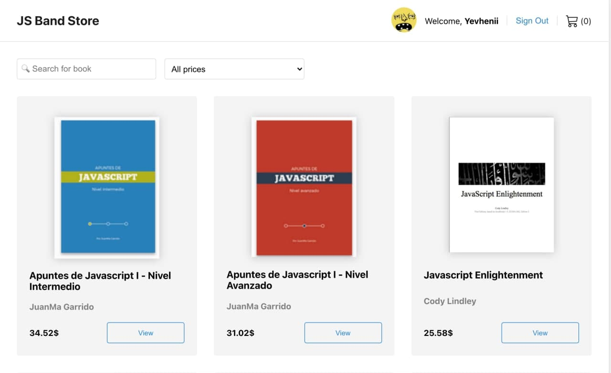

# Meeting planning calendar React

## Description

This is a simple book store application. User need to authorize to Log In.
Than User can filter and search books, browse specific book details, add a specific book to Cart.
Eventually user can browse Cart with items and make a purchase.

## Preview (click to open project)

[](https://zzzhyrov.github.io/js-band-store/)

## Tech stack

- **Create React App** as a boilerplate;
- React / Redux / Router / React Hooks / Redux-Thunk;
- SCSS;
- ESLint / styleLint / Prettier / Husky;
- PropTypes, Reselect.

## Completed by

> **Yevhenii Zhyrov**

> - [ GitHub](https://github.com/zzzhyrov)
> - [ Linkedin](https://www.linkedin.com/in/zhyrov/)

## To start project in development mode:

```sh
$ npm install             // install the dependencies
$ npm run start           // launch 'DevServer'
```

## To build project:

```sh
$ npm run build           // generate a 'production' build
```

## To deploy project to GitHub Pages

```sh
$ npm run build           // generate a 'production' build
$ npm run deploy          // deploy it to 'GitHub Pages'
```

## To launch eslint

```sh
$ npm run lint            // start analizing *.{js} code and searching issues over all app
$ npm run lint:fix        // start fixing as many issues as possible over all app
$ npm run stylelint       // start analizing *.{css,scss} code and searching issues over all app
$ npm run stylelint:fix   // start fixing in css/scss as many issues as possible over all app
```

## To launch tests

```sh
$ npm run test            // start tests over all app in 'watch' mode
$ npm run test:coverage   // start tests over all app with report
```
